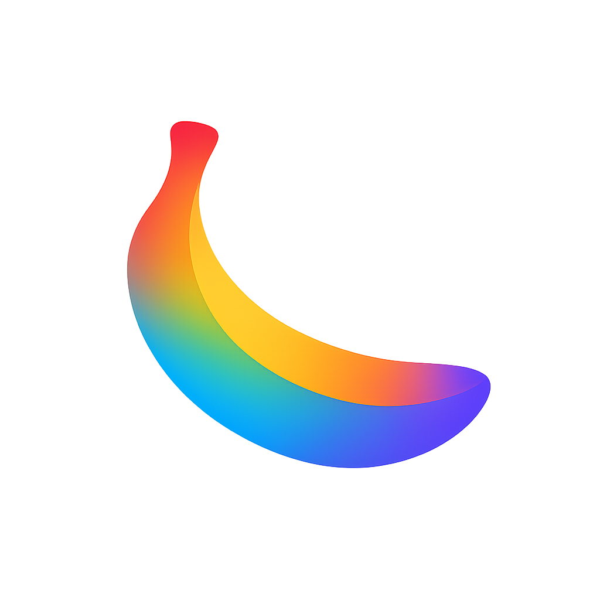

# 🍌 Nano - AI-Powered Image Editor

<div align="center">
  
  
  <h3>Transform your images with AI</h3>
  
  <p>Upload any image and describe the changes you want — powered by Google Gemini AI</p>

  [](https://vercel.com/new/clone?repository-url=https://github.com/4mohdisa/nano)
  
  [Live Demo](https://nano-edit.vercel.app) · [Report Bug](https://github.com/4mohdisa/nano/issues) · [Request Feature](https://github.com/4mohdisa/nano/issues)
</div>

---

## ✨ Features

- **🎨 Natural Language Editing** — Describe edits in plain English, no technical skills needed
- **⚡ Lightning Fast** — AI-powered editing in seconds using Google Gemini 2.5 Flash
- **🖼️ Before/After Comparison** — Side-by-side and overlay comparison views
- **💾 Local History** — Your edits are saved locally with IndexedDB and localStorage
- **🌙 Dark Mode** — Beautiful Gemini-inspired dark theme
- **📱 Fully Responsive** — Works seamlessly on desktop, tablet, and mobile
- **🔒 Privacy First** — Images processed securely, never stored on servers

## 🚀 Quick Start

### Prerequisites

- Node.js 18+ and npm/yarn
- Google AI API key (for Gemini)
- Supabase account (optional — works with localStorage fallback)

### Installation

1. **Clone the repository**
```bash
git clone https://github.com/4mohdisa/nano.git
cd nano
```

2. **Install dependencies**
```bash
npm install
```

3. **Set up environment variables**

Create a `.env.local` file in the root directory:

```env
# Required: Google AI (Gemini) API Key
GEMINI_API_KEY=your_google_ai_api_key_here

# Optional: Supabase (falls back to localStorage if not configured)
NEXT_PUBLIC_SUPABASE_URL=your_supabase_project_url
NEXT_PUBLIC_SUPABASE_ANON_KEY=your_supabase_anon_key
```

4. **Set up Supabase (Optional)**

If using Supabase, run this SQL in your Supabase SQL Editor:

```sql
-- Edit History Table
create table public.edit_history (
  id uuid default gen_random_uuid() primary key,
  original_image_url text not null,
  edited_image_url text,
  prompt text not null,
  analysis text,
  source_type text default 'upload',
  source_title text,
  source_url text,
  model text default 'gemini',
  status text default 'completed' check (status in ('pending', 'processing', 'completed', 'failed')),
  processing_time_ms integer,
  error_message text,
  created_at timestamptz default now() not null,
  updated_at timestamptz default now() not null
);

-- Analytics Table (anonymous usage tracking)
create table public.analytics (
  id uuid default gen_random_uuid() primary key,
  event_type text not null check (event_type in ('page_view', 'edit_request', 'edit_complete', 'edit_failed')),
  session_id text not null,
  metadata jsonb,
  created_at timestamptz default now() not null
);

-- Enable RLS and allow anonymous access
alter table public.edit_history enable row level security;
alter table public.analytics enable row level security;

create policy "Allow anonymous access" on public.edit_history for all using (true) with check (true);
create policy "Allow anonymous access" on public.analytics for all using (true) with check (true);

-- Indexes
create index edit_history_created_at_idx on public.edit_history (created_at desc);
create index analytics_event_type_idx on public.analytics (event_type);
create index analytics_session_idx on public.analytics (session_id);
```

5. **Run the development server**
```bash
npm run dev
```

6. **Open your browser**

Navigate to [http://localhost:3000](http://localhost:3000)

## 🎯 How to Use

### Simple 3-Step Process

1. **Upload** — Drag-and-drop your image or click to browse (PNG, JPG, WEBP up to 10MB)
2. **Describe** — Enter a text prompt describing the edits you want
3. **Generate** — Click "Generate Edit" and download your AI-enhanced image

### Example Prompts

- "Remove the background and make it transparent"
- "Add a sunset sky in the background"
- "Make it look like a vintage photograph"
- "Enhance the colors and increase contrast"
- "Remove the person on the left side"

## 🛠️ Tech Stack

| Category | Technology |
|----------|------------|
| **Framework** | Next.js 15 (App Router) |
| **Language** | TypeScript |
| **Styling** | Tailwind CSS |
| **UI Components** | shadcn/ui + Radix UI |
| **AI** | Google Gemini 2.5 Flash |
| **Database** | Supabase PostgreSQL (optional) |
| **Storage** | IndexedDB + localStorage |
| **Analytics** | Vercel Analytics |
| **Deployment** | Vercel |

## 📂 Project Structure

```
nano/
├── public/
│   ├── favicon/           # Favicon files
│   └── logo-icon.png      # App logo
├── src/
│   ├── app/
│   │   ├── api/
│   │   │   └── edit/      # Image editing API endpoint
│   │   ├── privacy/       # Privacy policy page
│   │   ├── terms/         # Terms of service page
│   │   ├── disclaimer/    # Disclaimer page
│   │   ├── app/           # Dashboard page
│   │   ├── page.tsx       # Home page with editor
│   │   ├── layout.tsx     # Root layout
│   │   └── globals.css    # Global styles & design system
│   ├── components/
│   │   ├── ui/            # shadcn/ui components
│   │   ├── upload-view.tsx
│   │   ├── editor-view.tsx
│   │   ├── history-view.tsx
│   │   └── image-viewer.tsx
│   └── lib/
│       ├── database.ts    # Multi-layer storage service
│       ├── supabase.ts    # Supabase client
│       └── utils.ts       # Utility functions
├── UI_THEME.md            # Design system documentation
└── README.md
```

## 🎨 Design System

Nano uses a Google Gemini-inspired dark theme with:

- **Background**: `#0D0D0F` (almost black)
- **Surface/Cards**: `#111113`
- **Accent Colors**:
  - Blue: `#3DB1FF`
  - Purple: `#8A5CFF`
  - Red: `#FF4F4F`
  - Yellow: `#FFBB33`
  - Green: `#4CE07D`

See [UI_THEME.md](./UI_THEME.md) for complete design documentation.

## 🔧 Configuration

### Google AI Setup

1. Visit [Google AI Studio](https://aistudio.google.com/app/apikey)
2. Create a new API key
3. Add it to your `.env.local` file as `GEMINI_API_KEY`

### Supabase Setup (Optional)

1. Create a project at [supabase.com](https://supabase.com)
2. Run the SQL schema from `supabase-schema.sql`
3. Add your project URL and anon key to `.env.local`
4. The app automatically falls back to localStorage if Supabase isn't configured

## 🚢 Deployment

### Deploy to Vercel (Recommended)

[](https://vercel.com/new/clone?repository-url=https://github.com/4mohdisa/nano)

1. Click the button above or connect your GitHub repository to Vercel
2. Add environment variables in Vercel dashboard
3. Deploy automatically on every push

### Other Platforms

The app can be deployed to any platform supporting Next.js:
- Netlify
- Railway
- DigitalOcean App Platform
- AWS Amplify

## 📝 Available Scripts

```bash
npm run dev      # Start development server
npm run build    # Build for production
npm run start    # Start production server
npm run lint     # Run ESLint
```

## 🔐 Privacy & Security

- **No Server Storage**: Images are processed and returned immediately, never stored
- **Local History**: Edit history is stored only in your browser
- **Secure Processing**: All API calls use HTTPS encryption
- **No Tracking**: Minimal analytics, no personal data collection

## 🤝 Contributing

Contributions are welcome! Here's how you can help:

1. Fork the repository
2. Create a feature branch (`git checkout -b feature/amazing-feature`)
3. Commit your changes (`git commit -m 'Add amazing feature'`)
4. Push to the branch (`git push origin feature/amazing-feature`)
5. Open a Pull Request

## 📄 License

This project is licensed under the MIT License — feel free to use it for personal or commercial purposes.

## 🙏 Acknowledgments

- [Google Gemini AI](https://ai.google.dev/) — Powerful AI models
- [shadcn/ui](https://ui.shadcn.com/) — Beautiful UI components
- [Next.js](https://nextjs.org/) — React framework
- [Tailwind CSS](https://tailwindcss.com/) — Utility-first CSS
- [Vercel](https://vercel.com/) — Deployment platform

## 📧 Support

For issues, questions, or feature requests:
- [Open an issue](https://github.com/4mohdisa/nano/issues)
- [Start a discussion](https://github.com/4mohdisa/nano/discussions)

---

<div align="center">
  <p>Built by <a href="https://github.com/4mohdisa">@4mohdisa</a></p>
  <p>Powered by Google Gemini AI</p>
</div>
